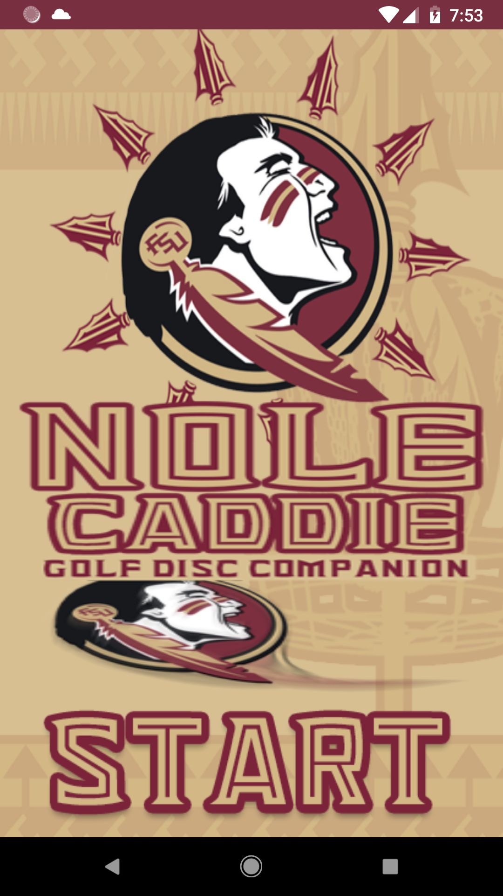
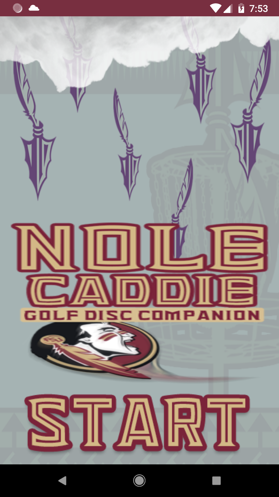
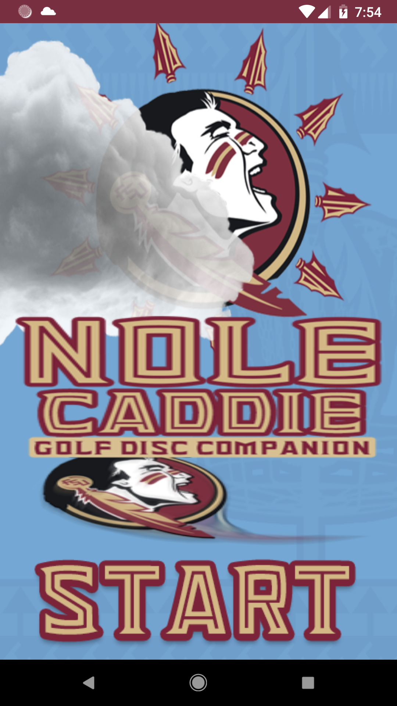

# NoleCaddyProj
Team SyntacticSugar Project, Florida State University Panama City 2015

## What does this app do?
Well, a bunch of stuff

* Shows weather of the disc golf course (sunny, rainy, or cloudy) thanks to <a href="https://openweathermap.org/">OpenWeatherMap</a>

  
  
  

* Shows geomapped hole locations
* Calculates distance to next hole
* Keeps track of score

At least it used to...

## Currently

* Bringing it up to speed for Android 5-latest
* Fixing map functionality
